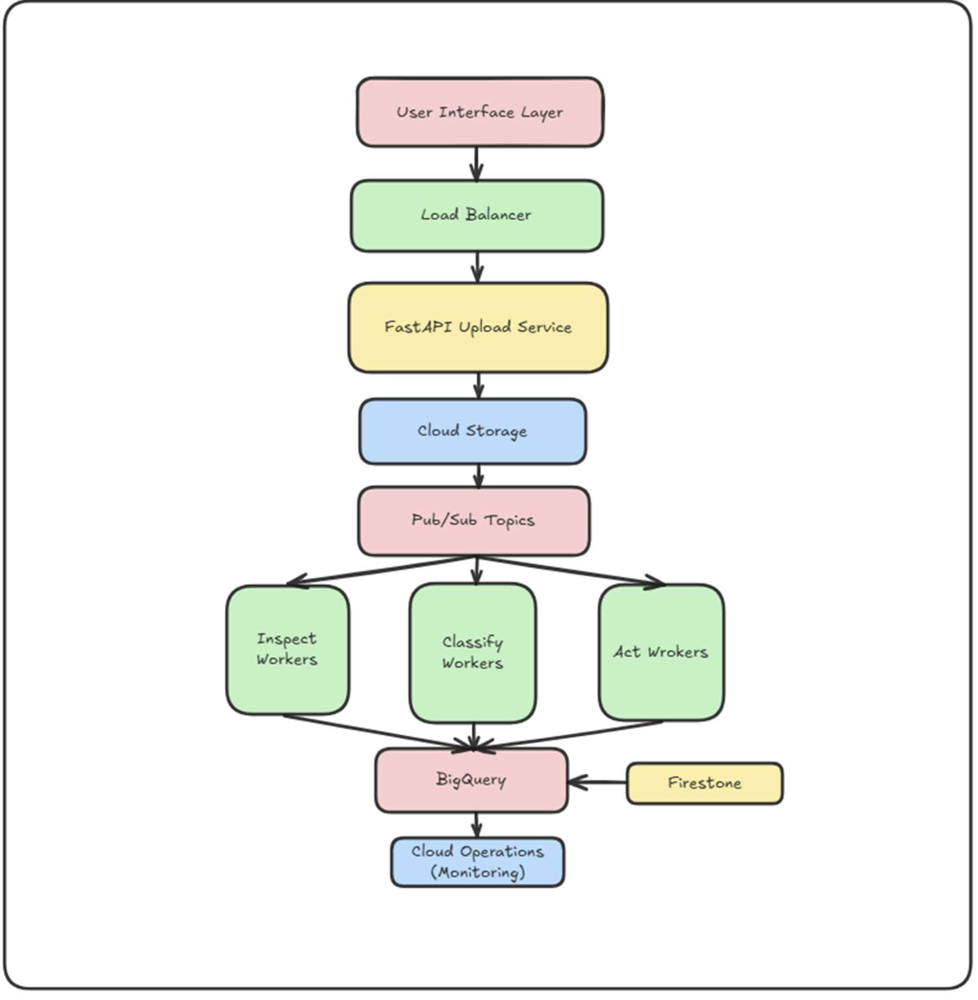

# **Distributed Rule-Based File Orchestrator (DRBFO)**

_A cloud-native file automation system that processes, inspects, classifies, and organizes files at datacenter scale using deterministic rules._

---

# **Project Overview**

Organizations frequently receive thousands of files daily through APIs, portals, shared drives, and emails. Manual organization is:

- Slow
- Error-prone
- Not scalable

**Distributed Rule-Based File Orchestrator (DRBFO)** solves this by creating a **fully automated, event-driven, serverless file-processing pipeline**.

the system:

- Automatically **ingests → inspects → classifies → acts** on files
- Uses **deterministic rules** based on metadata, signatures, and patterns (instead of AI)
- Achieves datacenter-level throughput and reliability

---

## **Project Goals & Success Criteria**

- Process **5000+ files/hour** with horizontal auto-scaling
- Achieve **99.9% availability**
- Enable cost efficiency via lifecycle management
- Provide detailed monitoring (P50/P95 latency)
- Automatically scale workers based on queue depth

---

# 🏗️ **System Architecture**

### High-Level Architecture Diagram



```
User Interface Layer → Load Balancer → FastAPI Upload Service
       ↓
Cloud Storage
       ↓
Pub/Sub Topics
       ↓
Inspect Workers → Classify Workers → Act Workers
       ↓
BigQuery (analytics)
Firestore (job tracking)
Cloud Operations (monitoring)
```

### Multi-Stage Pipeline

#### **1. Ingest Stage**

- `/upload` API receives files
- File is uploaded to GCS
- Metadata + job ID generated
- Published to **ingest-topic**
- Firestore: `job_status = PENDING`

#### **2. Inspect Stage**

- Reads first 8 KB of file
- Extract MIME, magic bytes, EXIF, PDF metadata
- Computes SHA-256 hash
- Runs regex patterns (dates, invoices, amounts)
- Inserts data into **BigQuery analytics table**
- Publishes enriched metadata to **classify-topic**
- Firestore: `job_status = INSPECTED`

#### **3. Classify Stage**

- Loads rule configs from Firestore (YAML)
- Applies deterministic rules:

  - Invoices → Finance/Invoices
  - Source code → Development/Code
  - Photos → Personal/Photos

- Determines actions
- Publishes to **act-topic**
- Firestore: `job_status = CLASSIFIED`

#### **4. Act Stage**

- Moves files to correct folder
- Applies metadata tags + labels
- Configures retention (e.g., 7-year legal hold)
- Archives to Coldline/Nearline
- Inserts final metadata into BigQuery
- Firestore: `job_status = COMPLETED`
- Optional: Sends notifications

---

# **Software & Hardware Components**

### **Google Cloud Services**

- Cloud Storage (multi-bucket)
- Cloud Pub/Sub (topics for each stage + DLQs)
- Cloud Run (workers)
- BigQuery (analytics)
- Firestore (job status + rules)
- Cloud Load Balancer
- Cloud Functions (storage triggers)
- Secret Manager
- VPC Networking
- Cloud Operations (Monitoring/Logging/Tracing)

### **Development Stack**

- FastAPI
- Python
- Docker
- YAML for rule config
- libmagic, PyPDF2, Pillow (content analysis)
- Redis (optional caching)

---

# **Repository Structure**

```
cloud-file-orchestrator/
│
├── services/
│   ├── api/
│   ├── inspect_worker/
│   ├── classify_worker/
│   └── act_worker/
│
├── common/
│   └── config.py
│
├── tests/
│   ├── conftest.py
│   ├── test_inspect_worker.py
│   ├── test_classify_worker.py
│   └── test_act_worker.py
│
├── requirements.txt
└── README.md
```

---

# **Debugging & Testing Strategy**

### **Development Testing**

- Local dev using Docker + Pub/Sub emulator
- Unit tests (pytest)
- Integration tests with multi-file datasets
- Load testing using **JMeter – 10k+ files/hour**
- Contract tests for API schema
- Rule validation tests

### **Production Debugging**

- Distributed tracing (Cloud Trace)
- Structured logging (JSON logs)
- DLQ for failed messages
- Circuit breakers for fault isolation
- Readiness/liveness probes

Our repo includes unit tests validating `/pubsub-push` for all workers.

---

# Meeting Cloud Technology Requirements

- Event-driven messaging (Pub/Sub + DLQs)
- Serverless compute (Cloud Run)
- Managed storage (GCS, BigQuery, Firestore)
- Networking (VPC, Private Subnets, IAM)
- Observability (Cloud Operations Metrics, Alerting)
- Modern cloud patterns (microservices, CQRS, autoscaling)

---

# Real-World Impact & Innovation

### **Enterprise Use Cases**

- Legal firms: contract categorization
- Healthcare: HIPAA-compliant medical record organization
- Finance: invoice routing + retention
- Media companies: digital asset sorting

### **Innovation**

- Deterministic rule engine = explainable
- Datacenter-scale throughput
- Storage cost-optimization via lifecycle policies
- Fully observable microservice architecture

---

# Deployment Guide (Simplified)

### Build & deploy a worker

```bash
gcloud builds submit --tag gcr.io/$PROJECT_ID/inspect-worker
gcloud run deploy inspect-worker \
  --image gcr.io/$PROJECT_ID/inspect-worker \
  --region us-central1 --platform managed
```

### deploy inspect_worker

```bash
gcloud run deploy cfo-inspect-worker --source . --region=$REGION --allow-unauthenticated
```

### Deploy Api

```bash
gcloud run deploy cfo-api \
  --source . \
  --project $PROJECT_ID \
  --region $REGION \
  --allow-unauthenticated \
  --set-env-vars SOURCE_BUCKET=drbfo-uploads \
  --set-env-vars UI_ORIGINS="*"

```

### Deploy classify_worker

```bash
gcloud run deploy cfo-classify-worker --source . --region=$REGION
```

### Deploy act_worker

```bash
gcloud run deploy cfo-act-worker --source . --region=$REGION
```

### Connect workers via Pub/Sub

```bash
gcloud pubsub topics create inspect-topic
gcloud pubsub subscriptions create inspect-sub \
  --topic inspect-topic \
  --push-endpoint="https://<url>/pubsub-push"
```

Repeat for classify + act workers.

---

# Running Tests

```bash
pytest
```

Tests simulate Pub/Sub push events to ensure worker stability.

---

# Future Enhancements

- Rich UI for rule management
- Real-time dashboard
- Multi-bucket & multi-tenant orchestration
- Advanced rule engine with caching
- Parallel batch processing
